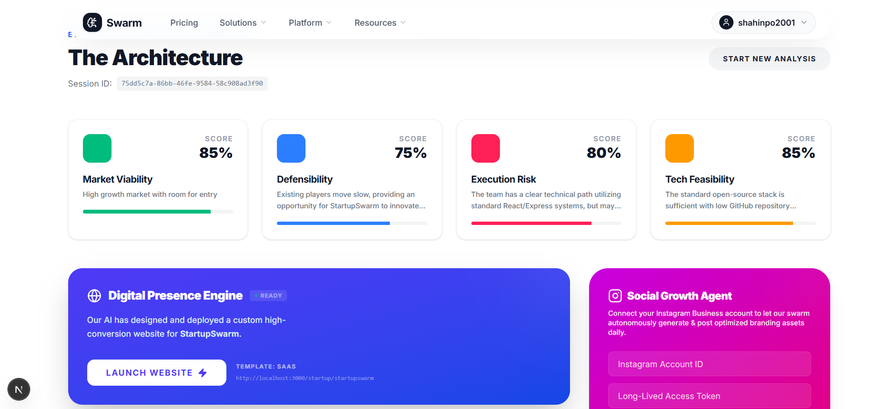

# 🛸 Startup Swarm - Removing the Fear of Starting a Business

**Startup Swarm** is an end-to-end autonomous entrepreneurship platform. We don't just analyze your business idea — our swarm of specialized AI agents actually builds the foundation of your company for you.


---

## 🌟 Key Features

### 🤖 Autonomous Agent Swarm
A specialized board of AI agents that collaborate to engineer your startup:
- **Market Research Agent 📊**: Analyzes viability, market size, and target personas.
- **Competition Intelligence Agent 🛡️**: Identifies moats, network effects, and defensibility.
- **Execution Risk Agent 🏗️**: Evaluates founder-market fit and technical gaps.
- **Product-Market Fit Agent 🎯**: Validates the urgency of the problem and market demand.

### 🌐 Instant Infrastructure
- **Automatic Website Generation**: The swarm doesn't just design; it launches a working MVP landing page for your business.
- **Strategic Blueprints**: Receive a comprehensive JSON-based roadmap including revenue models, cost structures, and growth opportunities.

### 📱 Real-Time Social & Growth Automation
- **Instagram Automation**: Automated content strategy and post suggestions to build your brand presence.
- **Real-Time News Fetching**: Stays updated with the latest industry trends and competitor moves.
- **Real-Time Product Fetching**: Syncs with global product databases to analyze existing solutions.
- **Mail Service**: Integrated real-time mail notifications and automated outreach support.

---

## 🛠️ Technology Stack

### Frontend
- **Framework**: [Next.js](https://nextjs.org/) (App Router)
- **Styling**: [Tailwind CSS](https://tailwindcss.com/)
- **Components**: [Shadcn UI](https://ui.shadcn.com/)
- **State Management**: Redux Toolkit
- **Icons**: Lucide React

### Backend
- **Runtime**: [Node.js](https://nodejs.org/)
- **Framework**: [Express.js](https://expressjs.com/)
- **Language**: [TypeScript](https://www.typescriptlang.org/)
- **Database**: [MongoDB](https://www.mongodb.com/)
- **AI Orchestration**: LangGraph, LangChain
- **LLM**: [Groq API](https://groq.com/) (Llama 3.3 70B Versatile)

---

## 🚀 Getting Started

### Prerequisites
- Node.js (v18+)
- MongoDB Atlas account or local MongoDB
- Groq API Key

### Installation

#### 1. Clone the Repository
```bash
git clone https://github.com/your-username/startup-swarm.git
cd startup-swarm
```

#### 2. Server Setup (Backend)
```bash
cd server
npm install
```
- Copy `.env.example` to `.env` and fill in your credentials (MongoDB URI, Groq Keys, etc.).
- Run the server:
```bash
npm run dev
```

#### 3. Client Setup (Frontend)
```bash
cd client
npm install
```
- Run the development server:
```bash
npm run dev
```

### 🔑 Environment Variables

Create a `.env` file in the `server` directory and add the following:

```env
MONGO_URI=mongodb_uri_here
NODE_ENV=development
PORT=5000
CLIENT_URL=http://localhost:3000

JWT_SECRET=your_jwt_secret_key_here
JWT_EXPIRES_IN=7d

SMTP_HOST=smtp.gmail.com
SMTP_PORT=587
SMTP_USER=your_email@gmail.com
SMTP_PASS=your_app_password

GOOGLE_CLIENT_ID=your_google_client_id
GOOGLE_CLIENT_SECRET=your_google_client_secret

GROQ_API_KEY_1=gsk_...
GROQ_API_KEY_2=gsk_...
GROQ_API_KEY_3=gsk_...
GROQ_API_KEY_4=gsk_...

GEMINI_API_KEY=AIzaSy...
NEWS_DATA_API_KEY=pub_...
OPEN_WEB_NINJA_API_KEY=ak_...

CLOUDINARY_CLOUD_NAME=...
CLOUDINARY_API_KEY=...
CLOUDINARY_API_SECRET=...

RAZORPAY_KEY_ID=rzp_test_...
RAZORPAY_KEY_SECRET=...

TWOSLIDES_API_KEY=sk-2slides-...
```

---

## 📸 Screenshots

| Interactive Questionnaire | Strategy Blueprint |
|---|---|
|  |  |

---

## 🌌 The Celestials Team

**Startup Swarm** is designed and engineered with ❤️ by **Team Celestials**:

- **Mohammed Shahinsha**
- **Shamveel P**
- **Akshay C**
- **Hina Hanan**
- **Sangeeth**

---

## 📞 Support & Community

Startup Swarm is built to remove the barrier to entry for founders everywhere. If you encounter issues or have suggestions, feel free to open a PR or an issue!

Built with ⚡ by **Team Celestials**.